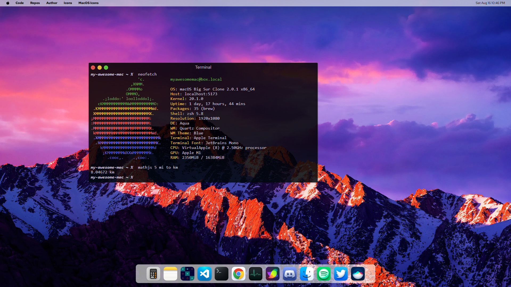
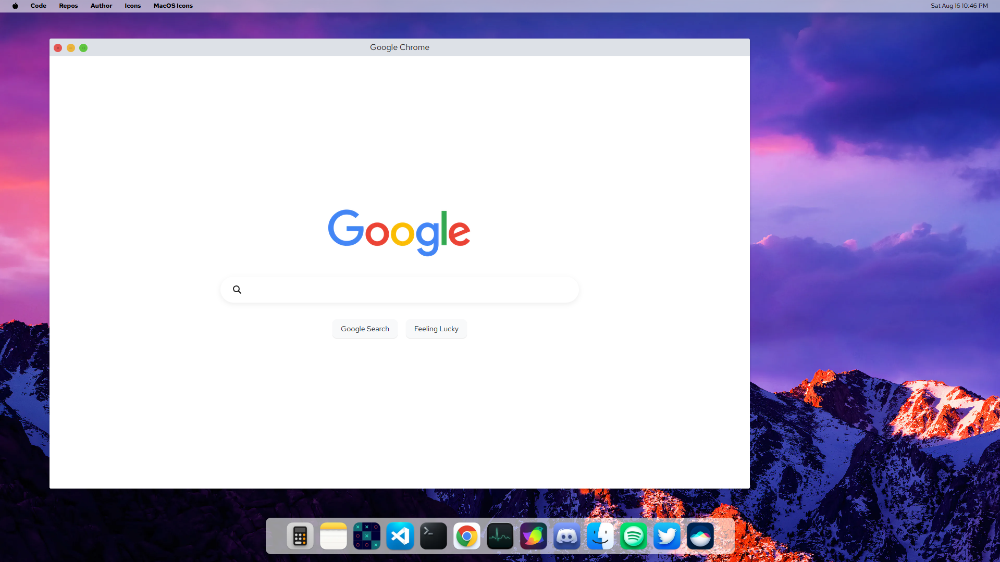
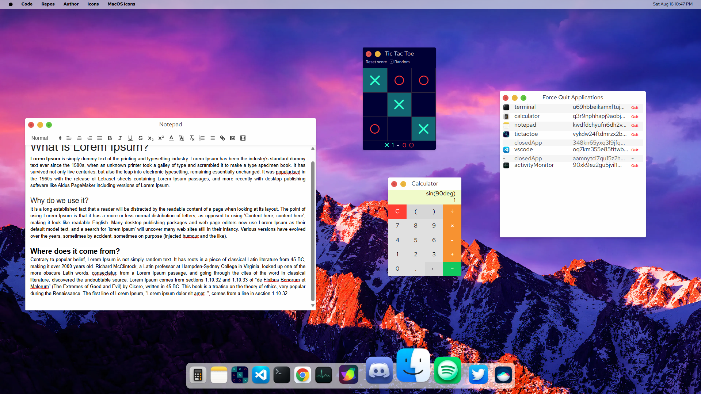

# Mac desktop clone

An artistic project of a clone of a mac desktop windows system ans some little functional apps using Svelte + Vite.

live demo [right here.](https://mac-desktop-clone.netlify.app/)

  

## New Version Features

- **Starring:** Terminal app with commands and functions.
- Migrated to Svelte 5 runes.
- Splitted app components with dynamic imports to improve performance.
- Improved Tic Tac Toe app: add automatic next round when winning and recording new first move and random player mode.
- Using color circles like the traditional mac os minimize, maximize and close buttons and put at the left side of the window.
- Improved Notepad toolbar sticky position with scroll for content and correct z-index.

## Features

- Apps _"drag n' drop"_ resizing, moving and expanding windows.
- All apps work at least in the basics.
- Date and hour indication.
- Pretty animations and icons.

## Applications

Available and meant.

- [x] **Calculator:** Basic calculations and functions, free of xss-attack. Powered by math.js
- [x] **Notepad:** WYSIWYG editor. Powered by Quill.
- [x] **Code editor:** Inspirated on Visual Studio Code. Powered by Codemirror.
- [x] **Tic Tac Toe:** Playable with score count and random player mode.
- [x] **Command Terminal:** Basic commands and functions.
- [x] **Browser** (at least a google search clone \*).
- [x] **Activity Monitor:** Basic system monitor to list open apps.
- [ ] Music Player
- [ ] Video Player
- [ ] File system
- [ ] Photo gallery
- [ ] Paint
- [ ] Calendar

## Meant features and adjusts

- [x] Assets optimization. \*
- [ ] Responsive desktop.
- [ ] Add keyboard shortcuts.
- [ ] Better window animations (genie effect).
- [ ] More than an instance of every app.
